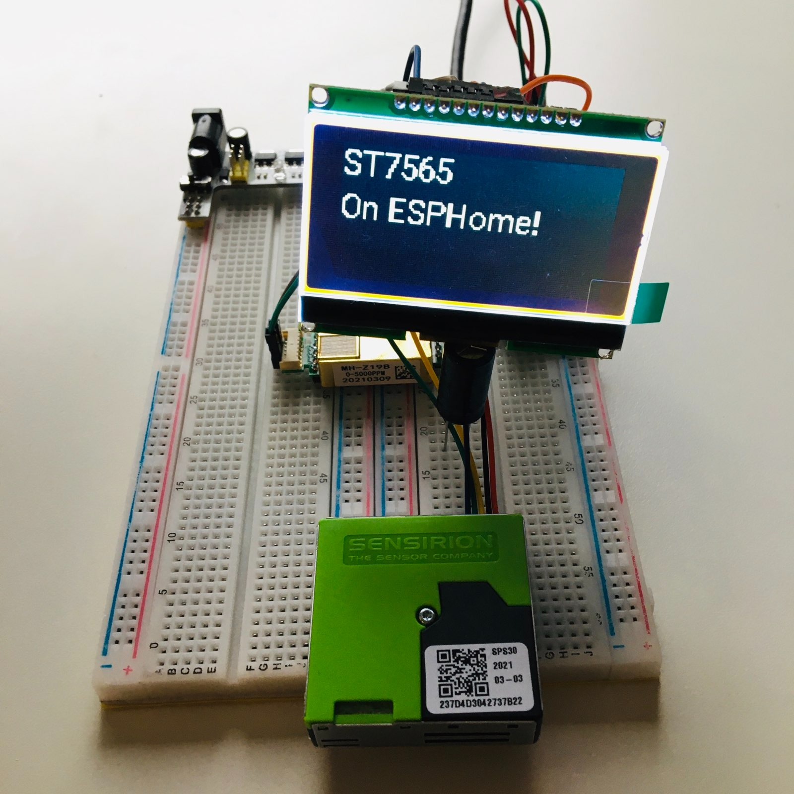

# ST7565 Display Component for ESPHome

This repository implements an [ESPHome](https://esphome.io/) display component
for ST7565 displays.



## Installation

To use this component in your project you will have to add it as an external
component by adding the following to your configuration YAML:

```yaml
external_components:
  - source: github://monorkin/esphome_st7565@main
    components: [ st7565 ]
```

Then you will have to setup an SPI bus as the display communicates over 4-wire SPI.
You will have to add something like the following to your configuration YAML,
the exact pins and id might be different for your setup:

```yaml
spi:
  - clk_pin: D5
    mosi_pin: D6
    id: primary_spi_bus
```

Finally, you add the display like any other ESPHome display module.

Notice that you *have to* configure a CS (chip select) pin as with any other
SPI device, but you also *have to* define a DC (data/command) pin - sometimes
labeled RS (register select). You can optionally pass a contrast value (0 to 63),
a width and a hight (for screens that are 136x65) and a reset pin
(the display should function properly in most cases even without it attached).

```yaml
 display:
   - platform: st7565
     spi_id: primary_spi_bus
     width: 128
     height: 64
     contrast: 16
     dc_pin:
       number: D8
     cs_pin:
       number: D7
     reset_pin:
       number: D0
     # rotation: 180 # If you mount the display upside down
     lambda: |-
       it.print(0, 0, id(my_font), "ST7565");
       it.print(0, 20, id(my_font), "On ESPHome!");
```

## Example

There is a minimal example configuration

```yaml
external_components:
  - source: github://monorkin/esphome_st7565@main
    components: [ st7565 ]

# Project configuration - you have to configure this for your setup!
# esphome:
#   name: my-project
#   platform: ESP8266
#   board: nodemcuv2

spi:
  - clk_pin: D5
    mosi_pin: D6
    id: primary_spi_bus

display:
  - platform: st7565
    spi_id: primary_spi_bus
    width: 128
    height: 64
    contrast: 16
    dc_pin:
      number: D8
    cs_pin:
      number: D7
    reset_pin:
      number: D0
    # rotation: 180 # If you mount the display upside down
    lambda: |-
      it.print(0, 0, id(my_font), "ST7565");
      it.print(0, 20, id(my_font), "On ESPHome!");
```

## License

This project is dual-licensed under the GPLv3 (all C++ code) and the
MIT license (all Python code).

You can read the details in the [LICENSE file](./LICENSE), but a TL;DR is
that the code was initially created by the ESPHome team, it comes with no
warranty of any kind, the C++ code must stay open-source, and derivatives
(forks) must contain a notice about the original's authors.

These licenses were inherited from the ESPHome project from where most of the
code was extracted, and then adjusted to work with the ST7565 display drivers.

That's it, enjoy!
